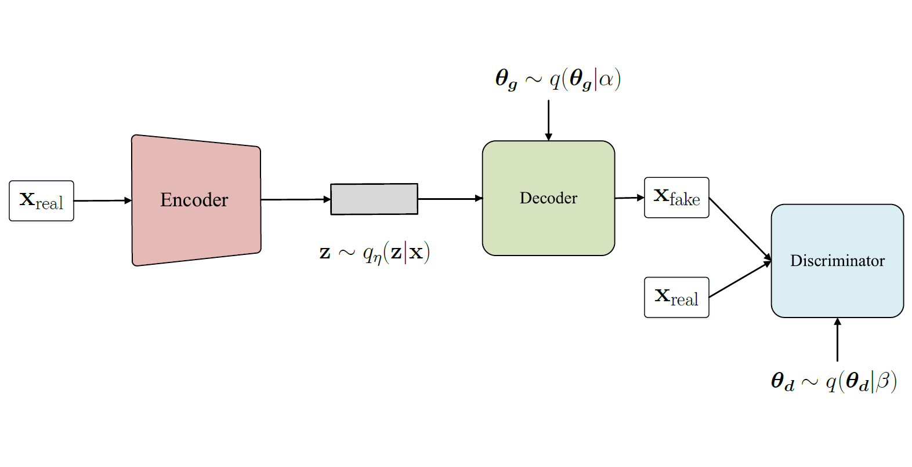
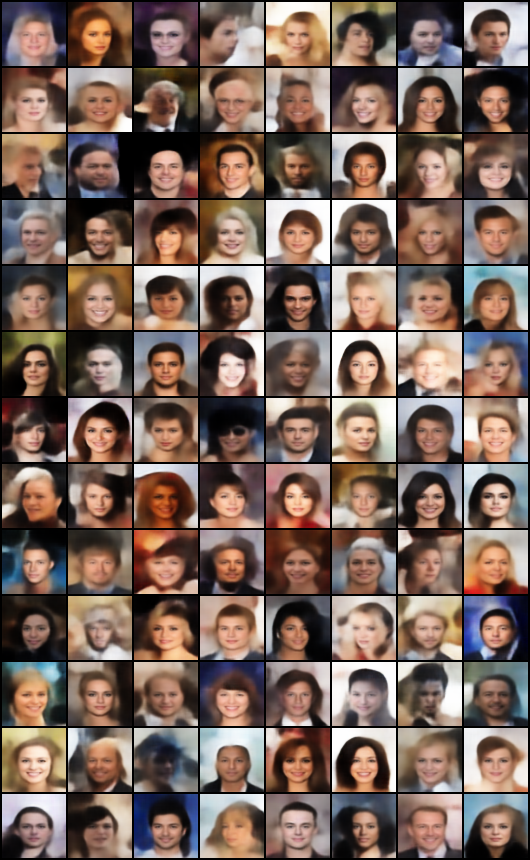
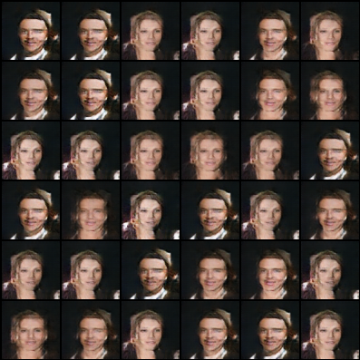
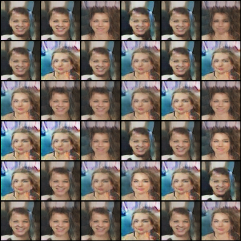
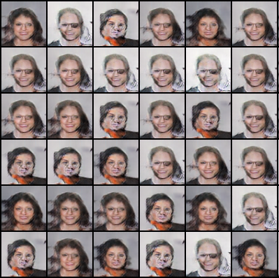
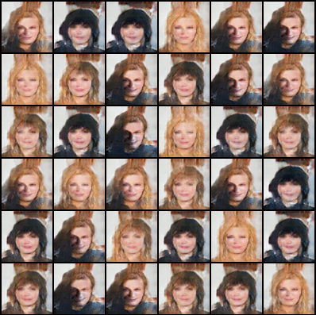
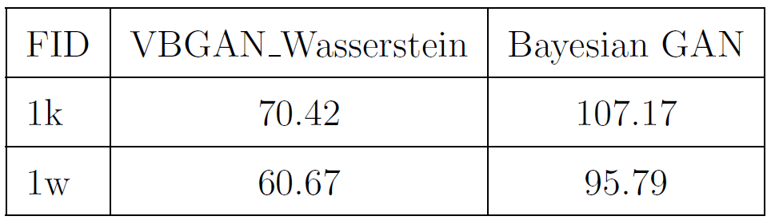

# Variational Bayesian GAN for Face generation
* CelebFaces Attributes Dataset (CelebA) is a large-scale face attributes dataset with more than 200K celebrity images, each with 40 attribute annotations. The images in this dataset cover large pose variations and background clutter. CelebA has large diversities, large quantities, and rich annotations, including

    * 10,177 number of identities,

    * 202,599 number of face images, and

    * 5 landmark locations, 40 binary attributes annotations per image
* We do the experiment on this dataset with align using similarity transformation according to the two eye locations and cropped in image generation task. 
    *  resized images to 64 * 64
    *  without annotation in unsupervised way.
    *  sample 1k and 10k images to measure the Frchet Inception Distance (FID) beteween sample data and real data

Bayesian GAN credit to https://github.com/vasiloglou/mltrain-nips-2017/blob/master/ben_athiwaratkun/pytorch-bayesgan/Bayesian%20GAN%20in%20PyTorch.ipynb

Bayesian CNN credit to https://github.com/felix-laumann/Bayesian_CNN

FID credit to https://github.com/mseitzer/pytorch-fid

  
  

## Setting
- Framework:
    - Pytorch 0.4.0
- Hardware:
	- CPU: Intel Core i7-2600 @3.40 GHz
	- RAM: 20 GB DDR4-2400
	- GPU: GeForce GTX 980

## Result of VBGAN_Wasserstein metric
  

## Result of each mode in Bayesian GAN
  

  
 
 
 ## Fréchet Inception Distance
 

 

